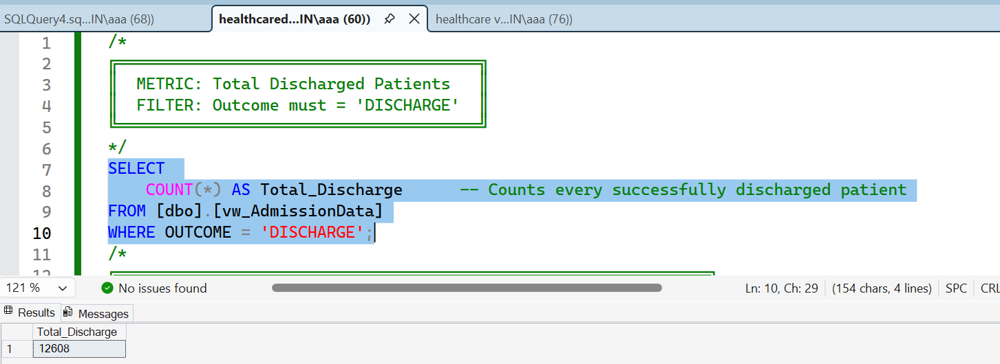
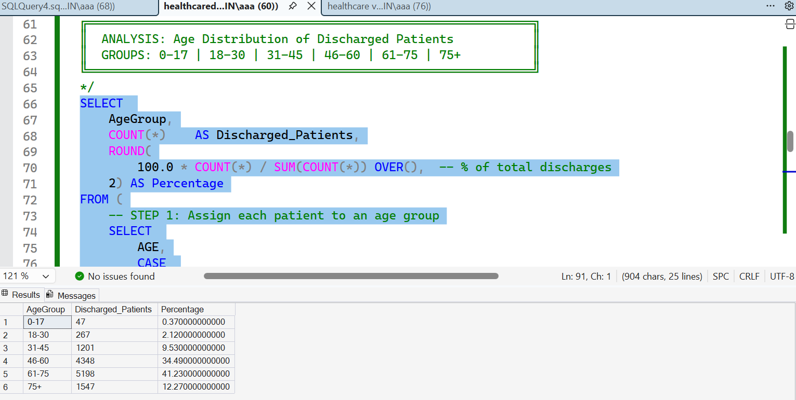
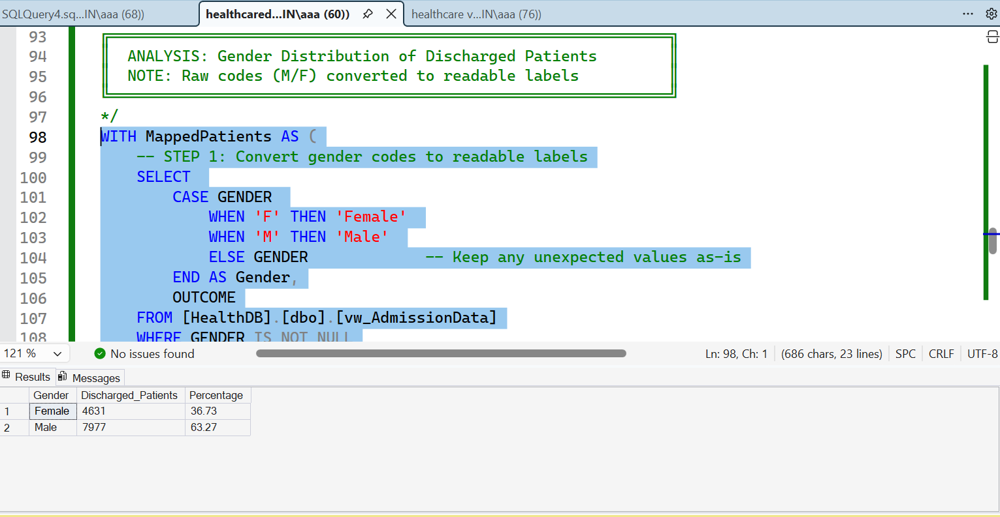
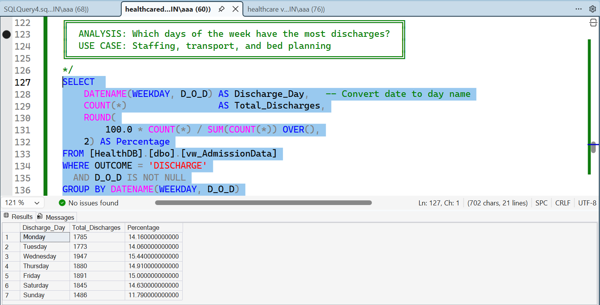

# 🏥 Hospital Discharge Analytics — SQL Server Project

---

## 📌 Project Overview

This project analyzes hospital patient discharge data using 
Microsoft SQL Server (T-SQL). It transforms raw admission records 
into actionable insights for hospital management, covering patient 
volumes, demographics, length of stay, and discharge timing patterns.

---

## 🎯 Business Questions Answered

| # | Question |
|---|----------|
| 1 | How many patients were successfully discharged? |
| 2 | What is the average number of discharges per day? |
| 3 | How long do patients typically stay in the hospital? |
| 4 | How many bed-days are used per discharged patient? |
| 5 | Which age groups have the most discharges? |
| 6 | What is the gender split among discharged patients? |
| 7 | Which days of the week see the most discharges? |

---

## 🗄️ Database Details

| Property       | Value                     |
|----------------|---------------------------|
| Database Name  | HealthDB                  |
| Source Table   | HDHI Admission data       |
| Clean View     | dbo.vw_AdmissionData      |
| SQL Dialect    | Microsoft T-SQL           |
| Tool Used      | SQL Server Management Studio (SSMS) |

---
---

## 📊 Query Results & Screenshots

### 1️⃣ Total Discharges

---

### 2️⃣ Age Group Distribution

---

### 3️⃣ Gender Analysis

---

### 4️⃣ Day of Week Discharge Pattern

---
### 7️⃣ Day-of-Week Discharge Patterns
- Discharge volumes by weekday (Monday through Sunday)
- Supports staffing and operational planning

---
## 📂 Dataset

| Property | Details |
|----------|---------|
| **File Name** | HDHI Admission data.csv |
| **Format** | CSV (Comma Separated Values) |
| **Source** | Hospital Admission Records |

🔗 **[Download Dataset](HDHI%20Admission%20data.csv)**

## 🧹 Data Quality Measures
